---
## Front matter
lang: ru-RU
title: Презентация №1
subtitle: Установка и конфигурация операционной системы на виртуальную машину
author:
  - Аскеров А.Э.
institute:
  - Российский университет дружбы народов, Москва, Россия
date: 17 февраля 2024

## i18n babel
babel-lang: russian
babel-otherlangs: english

## Formatting pdf
toc: false
toc-title: Содержание
slide_level: 2
aspectratio: 169
section-titles: true
theme: metropolis
header-includes:
 - \metroset{progressbar=frametitle,sectionpage=progressbar,numbering=fraction}
 - '\makeatletter'
 - '\beamer@ignorenonframefalse'
 - '\makeatother'

## Fonts
mainfont: PT Serif
romanfont: PT Serif
sansfont: PT Sans
monofont: PT Mono
mainfontoptions: Ligatures=TeX
romanfontoptions: Ligatures=TeX
sansfontoptions: Ligatures=TeX,Scale=MatchLowercase
monofontoptions: Scale=MatchLowercase,Scale=0.9
---

# Вступление

## Цель работы

Целью данной работы является приобретение практических навыков установки операционной системы на виртуальную машину, настройки минимально необходимых для дальнейшей работы сервисов.

# Выполнение лабораторной работы

## Установка Rocky Linux

Создадим новую виртуальную машину. Для этого в VirtualBox выберем “Машина” “Создать”.

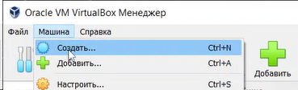{#fig:1 width=70%}

## Установка Rocky Linux

Укажем имя виртуальной машины (логин в дисплейном классе), тип операционной системы — Linux, RedHat (64-bit).

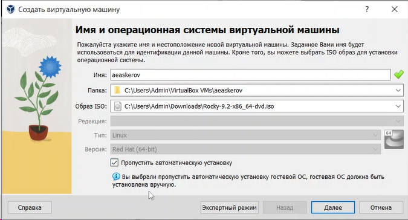{#fig:2 width=70%}

## Установка Rocky Linux

Укажем размер основной памяти виртуальной машины – 2048 МБ (или большее число, кратное 1024 МБ, если позволяют технические характеристики компьютера).

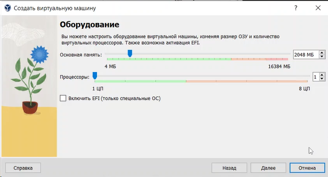{#fig:3 width=50%}

## Установка Rocky Linux

Зададим размер диска – 40 ГБ (или больше).

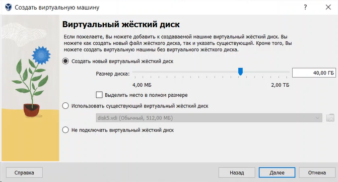{#fig:4 width=70%}

## Установка Rocky Linux

Посмотрим итог настроек виртуальной машины.

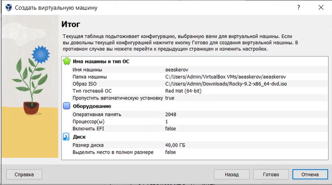{#fig:5 width=70%}

## Установка Rocky Linux

Запустим виртуальную машину.

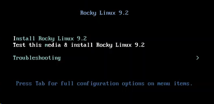{#fig:6 width=70%}

## Установка Rocky Linux

Выберем English в качестве языка интерфейса.

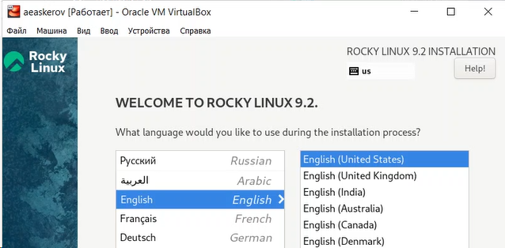{#fig:7 width=70%}

## Настройка Rocky Linux

Перейдём к настройкам установки операционной системы.

Выберем раскладку клавиатуры.

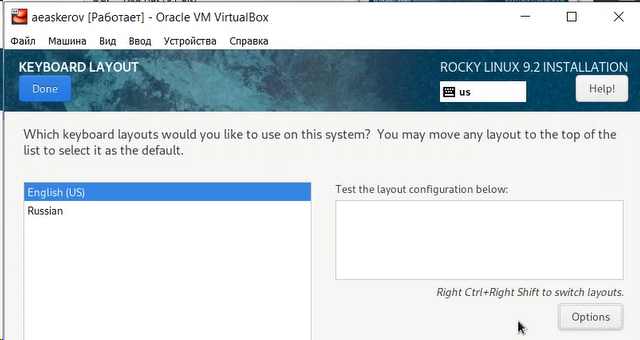{#fig:8 width=50%}

## Настройка Rocky Linux

В разделе выбора программ укажем в качестве базового окружения “Server with GUI”, а в качестве дополнения – “Development Tools”.

{#fig:9 width=50%}

## Настройка Rocky Linux

Отключим KDUMP.

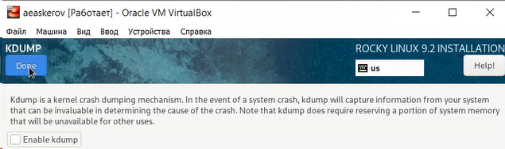{#fig:10 width=70%}

## Настройка Rocky Linux

Включим сетевое соединение и в качестве имени узла укажем user.localdomain, где вместо user укажем имя своего пользователя в соответствии с соглашением об именовании.

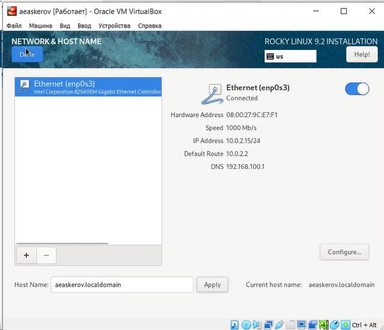{#fig:11 width=40%}

## Настройка Rocky Linux

Установим пароль для root.

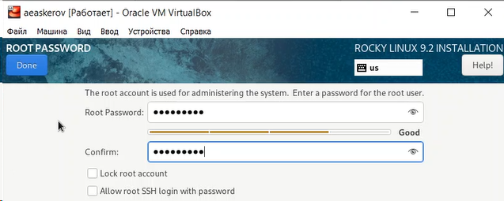{#fig:12 width=70%}

## Настройка Rocky Linux

Установим пароль для пользователя с правами администратора.

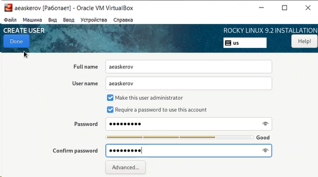{#fig:13 width=70%}

## Настройка Rocky Linux

После завершения установки операционной системы корректно перезапустим виртуальную машину и при запросе примем условия лицензии.

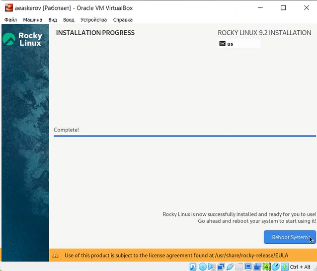{#fig:14 width=40%}

## Настройка Rocky Linux

Войдём в ОС под заданной при установке учётной записью. В меню Устройства виртуальной машины подключим образ диска дополнений гостевой ОС, при необходимости введём пароль пользователя root виртуальной ОС.

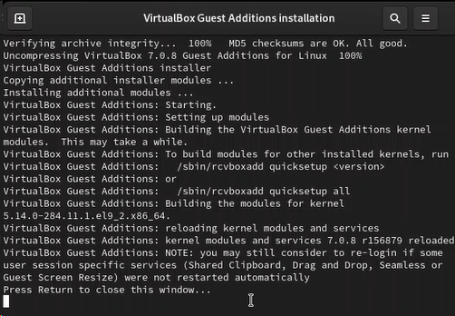{#fig:15 width=40%}

## Домашнее задание

Дождёмся загрузки графического окружения и откроем терминал. В окне терминала проанализируем последовательность загрузки системы, выполнив команду dmesg | less. Просто просмотрим вывод этой команды.

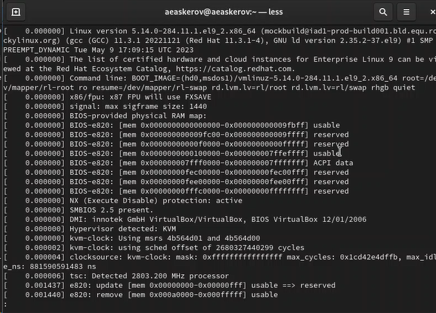{#fig:16 width=45%}

## Домашнее задание

Получим следующую информацию.

1. Версия ядра Linux (Linux version).

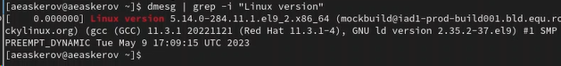{#fig:17 width=70%}

## Домашнее задание

2. Частота процессора (Detected MHz processor).

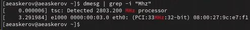{#fig:18 width=70%}

3. Модель процессора (CPU0).

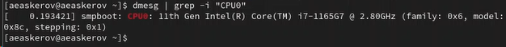{#fig:19 width=70%}

## Домашнее задание

4. Объём доступной оперативной памяти (Memory available).

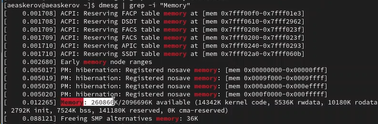{#fig:20 width=70%}

## Домашнее задание

5. Тип обнаруженного гипервизора (Hypervisor detected).

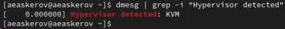{#fig:21 width=70%}

## Домашнее задание

6. Тип файловой системы корневого раздела.

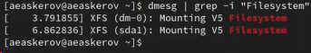{#fig:22 width=70%}

## Домашнее задание

7. Последовательность монтирования файловых систем.

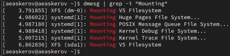{#fig:23 width=70%}

# Заключение

Приобретены практические навыки установки операционной системы на виртуальную машину, настройки минимально необходимых для дальнейшей работы сервисов.
