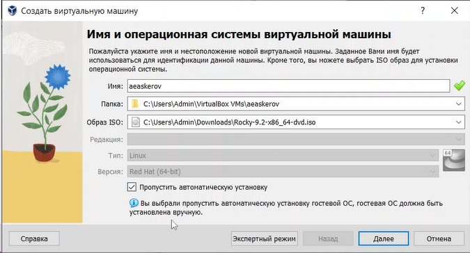
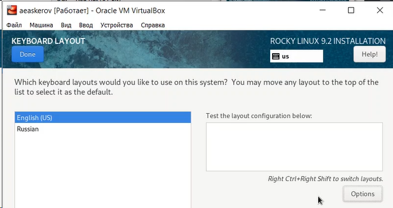
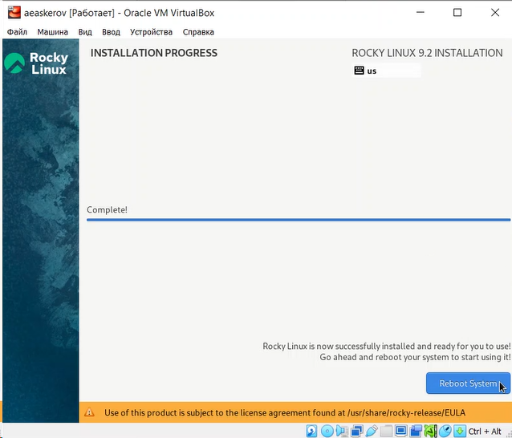
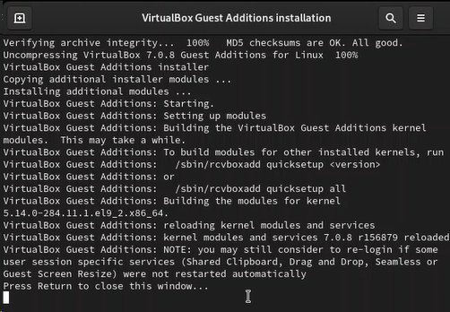
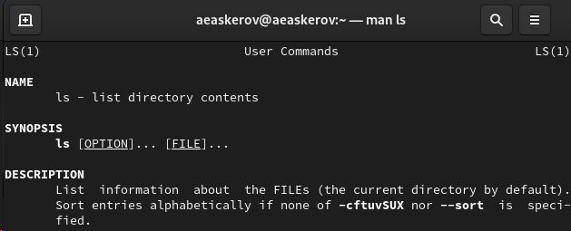
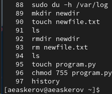

---
## Front matter
title: "Лабораторная работа №1"
subtitle: "Установка и конфигурация операционной системы на виртуальную машину"
author: "Аскеров Александр Эдуардович"

## Generic otions
lang: ru-RU
toc-title: "Содержание"

## Bibliography
bibliography: bib/cite.bib
csl: pandoc/csl/gost-r-7-0-5-2008-numeric.csl

## Pdf output format
toc: true # Table of contents
toc-depth: 2
lof: true # List of figures
lot: false # List of tables
fontsize: 12pt
linestretch: 1.5
papersize: a4
documentclass: scrreprt
## I18n polyglossia
polyglossia-lang:
  name: russian
  options:
	- spelling=modern
	- babelshorthands=true
polyglossia-otherlangs:
  name: english
## I18n babel
babel-lang: russian
babel-otherlangs: english
## Fonts
mainfont: PT Serif
romanfont: PT Serif
sansfont: PT Sans
monofont: PT Mono
mainfontoptions: Ligatures=TeX
romanfontoptions: Ligatures=TeX
sansfontoptions: Ligatures=TeX,Scale=MatchLowercase
monofontoptions: Scale=MatchLowercase,Scale=0.9
## Biblatex
biblatex: true
biblio-style: "gost-numeric"
biblatexoptions:
  - parentracker=true
  - backend=biber
  - hyperref=auto
  - language=auto
  - autolang=other*
  - citestyle=gost-numeric
## Pandoc-crossref LaTeX customization
figureTitle: "Рис."
tableTitle: "Таблица"
listingTitle: "Листинг"
lofTitle: "Список иллюстраций"
lotTitle: "Список таблиц"
lolTitle: "Листинги"
## Misc options
indent: true
header-includes:
  - \usepackage{indentfirst}
  - \usepackage{float} # keep figures where there are in the text
  - \floatplacement{figure}{H} # keep figures where there are in the text
---

# Цель работы

Целью данной работы является приобретение практических навыков установки операционной системы на виртуальную машину, настройки минимально необходимых для дальнейшей работы сервисов.

# Выполнение лабораторной работы

## Установка Rocky Linux

Создадим новую виртуальную машину. Для этого в VirtualBox выберем “Машина” “Создать”.

{#fig:1 width=70%}

Укажем имя виртуальной машины (логин в дисплейном классе), тип операционной системы — Linux, RedHat (64-bit).

{#fig:2 width=70%}

Укажем размер основной памяти виртуальной машины – 2048 МБ (или большее число, кратное 1024 МБ, если позволяют технические характеристики компьютера).

{#fig:3 width=70%}

Зададим размер диска – 40 ГБ (или больше).

{#fig:4 width=70%}

Посмотрим итог настроек виртуальной машины.

{#fig:5 width=70%}

Запустим виртуальную машину.

{#fig:6 width=70%}

Выберем English в качестве языка интерфейса.

{#fig:7 width=70%}

## Настройка Rocky Linux

Перейдём к настройкам установки операционной системы.

Выберем раскладку клавиатуры.

{#fig:8 width=70%}

В разделе выбора программ укажем в качестве базового окружения “Server with GUI”, а в качестве дополнения – “Development Tools”.

{#fig:9 width=70%}

Отключим KDUMP.

{#fig:10 width=70%}

Включим сетевое соединение и в качестве имени узла укажем user.localdomain, где вместо user укажем имя своего пользователя в соответствии с соглашением об именовании.

{#fig:11 width=70%}

Установим пароль для root.

{#fig:12 width=70%}

Установим пароль для пользователя с правами администратора.

{#fig:13 width=70%}

После завершения установки операционной системы корректно перезапустим виртуальную машину и при запросе примем условия лицензии.

{#fig:14 width=70%}

Войдём в ОС под заданной при установке учётной записью. В меню Устройства виртуальной машины подключим образ диска дополнений гостевой ОС, при необходимости введём пароль пользователя root виртуальной ОС.

{#fig:15 width=70%}

## Домашнее задание

Дождёмся загрузки графического окружения и откроем терминал. В окне терминала проанализируем последовательность загрузки системы, выполнив команду dmesg | less. Просто просмотрим вывод этой команды.

{#fig:16 width=70%}

Получим следующую информацию.

1. Версия ядра Linux (Linux version).

{#fig:17 width=70%}

2. Частота процессора (Detected MHz processor).

{#fig:18 width=70%}

3. Модель процессора (CPU0).

{#fig:19 width=70%}

4. Объём доступной оперативной памяти (Memory available).

{#fig:20 width=70%}

5. Тип обнаруженного гипервизора (Hypervisor detected).

{#fig:21 width=70%}

6. Тип файловой системы корневого раздела.

{#fig:22 width=70%}

7. Последовательность монтирования файловых систем.

{#fig:23 width=70%}

## Контрольные вопросы

1. Какую информацию содержит учётная запись пользователя?

Такую как имя пользователя, домашний каталог, оболочку по умолчанию, идентификатор пользователя (UID) и группы, к которым принадлежит пользователь.

2. Укажите команды терминала и приведите примеры:

* для получения справки по команде;

man команда (например, man ls для справки о команде ls)

{#fig:24 width=70%}

* для перемещения по файловой системе;

cd директория (например, cd /etc для перехода в каталог /etc)

{#fig:25 width=70%}

* для просмотра содержимого каталога;

Команда ls

{#fig:26 width=70%}

* для определения объёма каталога;

du -h директория (например, du -h /var/log для определения объёма каталога /var/log)

{#fig:27 width=70%}

* для создания/удаления каталогов/файлов;

mkdir директория / touch файл (например, mkdir newdir для создания каталога newdir и touch newfile.txt для создания файла newfile.txt). rmdir директория / rm -r директория / rm файл  (например, rmdir olddir для удаления каталога olddir и rm oldfile.txt для удаления файла oldfile.txt)

{#fig:28 width=70%}

* для задания определённых прав на файл/каталог;

chmod  разрешения файл (например, chmod 755 program.py для задания прав на выполнение, чтение и запись для владельца и чтение и выполнение для группы и остальных)

{#fig:29 width=70%}

* для просмотра истории команд.

Команда history

{#fig:30 width=70%}

3. Что такое файловая система? Приведите примеры с краткой характеристикой.

Файловая система – это способ организации и хранения данных на устройстве хранения информации.

Примеры файловых систем:

- ext4 (Extended File System 4): используется в Linux для хранения файлов и метаданных.

- NTFS (New Technology File System): используется в Windows для организации данных на диске.

- APFS (Apple File System): используется в macOS для управления данными на диске.

4. Как посмотреть, какие файловые системы подмонтированы в ОС?

Для просмотра подмонтированных файловых систем в ОС Linux можно использовать команду df -h.

{#fig:31 width=70%}

5. Как удалить зависший процесс?

Можно воспользоваться командой kill -9 PID, где PID - идентификатор процесса.

# Выводы

Приобретены практические навыки установки операционной системы на виртуальную машину, настройки минимально необходимых для дальнейшей работы сервисов.
