---
## Front matter
lang: ru-RU
title: Презентация №3
subtitle: Дискреционное разграничение прав в Linux. Два пользователя
author:
  - Аскеров А.Э.
institute:
  - Российский университет дружбы народов, Москва, Россия
date: 15 марта 2024

## i18n babel
babel-lang: russian
babel-otherlangs: english

## Formatting pdf
toc: false
toc-title: Содержание
slide_level: 2
aspectratio: 169
section-titles: true
theme: metropolis
header-includes:
 - \metroset{progressbar=frametitle,sectionpage=progressbar,numbering=fraction}
 - '\makeatletter'
 - '\beamer@ignorenonframefalse'
 - '\makeatother'

## Fonts
mainfont: PT Serif
romanfont: PT Serif
sansfont: PT Sans
monofont: PT Mono
mainfontoptions: Ligatures=TeX
romanfontoptions: Ligatures=TeX
sansfontoptions: Ligatures=TeX,Scale=MatchLowercase
monofontoptions: Scale=MatchLowercase,Scale=0.9
---
# Вступление

## Цель работы

Получение практических навыков работы в консоли с атрибутами файлов для групп пользователей.

# Выполнение лабораторной работы

## Дискреционное разграничение прав в Linux

В установленной операционной системе создадим учётную запись пользователя guest (используя учётную запись администратора).

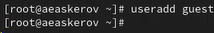{#fig:001 width=20%}

## Дискреционное разграничение прав в Linux

Зададим пароль для пользователя guest (использую учётную запись администратора).

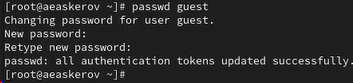{#fig:002 width=70%}

## Дискреционное разграничение прав в Linux

Аналогично создадим второго пользователя guest2.

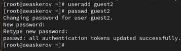{#fig:003 width=70%}

## Дискреционное разграничение прав в Linux

Добавим пользователя guest2 в группу guest.

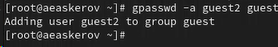{#fig:004 width=70%}

## Дискреционное разграничение прав в Linux

Осуществим вход в систему от двух пользователей на двух разных консолях: guest на первой консоли и guest2 на второй консоли.

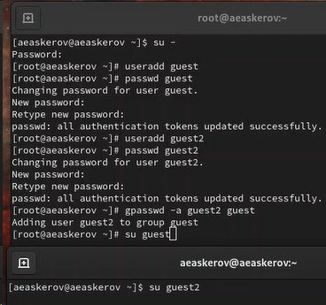{#fig:005 width=30%}

## Дискреционное разграничение прав в Linux

Для обоих пользователей командой pwd определим директорию, в которой вы находитесь.

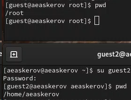{#fig:006 width=40%}

## Дискреционное разграничение прав в Linux

Уточним имя пользователя, его группу, кто входит в неё и к каким группам принадлежит он сам.

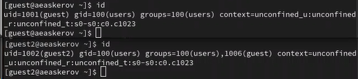{#fig:007 width=70%}

## Дискреционное разграничение прав в Linux

Определим командами groups guest и groups guest2, в какие группы входят пользователи guest и guest2. Сравним вывод команды groups с выводом команд id -Gn и id –G.

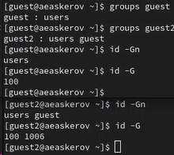{#fig:008 width=30%}

## Дискреционное разграничение прав в Linux

Сравним полученную информацию с содержимым файла /etc/group.

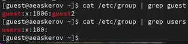{#fig:009 width=70%}

## Дискреционное разграничение прав в Linux

От имени пользователя guest2 выполним регистрацию пользователя guest2 в группе guest.

{#fig:010 width=70%}

## Дискреционное разграничение прав в Linux

От имени пользователя guest изменим права директории /home/guest, разрешив все действия для пользователей группы.

{#fig:011 width=70%}

## Дискреционное разграничение прав в Linux

От имени пользователя guest снимим с директории /home/guest/dir1 все атрибуты.

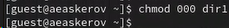{#fig:012 width=70%}

## Дискреционное разграничение прав в Linux

Проверим правильность снятия атрибутов.

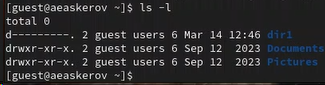{#fig:013 width=70%}

# Заключение

В ходе выполнения работы, мы смогли приобрести практические навыки работы в консоли с атрибутами файлов для групп пользователей.
