---
## Front matter
lang: ru-RU
title: Презентация №4
subtitle: Дискреционное разграничение прав в Linux. Расширенные атрибуты
author:
  - Аскеров А.Э.
institute:
  - Российский университет дружбы народов, Москва, Россия
date: 29 марта 2024

## i18n babel
babel-lang: russian
babel-otherlangs: english

## Formatting pdf
toc: false
toc-title: Содержание
slide_level: 2
aspectratio: 169
section-titles: true
theme: metropolis
header-includes:
 - \metroset{progressbar=frametitle,sectionpage=progressbar,numbering=fraction}
 - '\makeatletter'
 - '\beamer@ignorenonframefalse'
 - '\makeatother'
 
## Fonts
mainfont: PT Serif
romanfont: PT Serif
sansfont: PT Sans
monofont: PT Mono
mainfontoptions: Ligatures=TeX
romanfontoptions: Ligatures=TeX
sansfontoptions: Ligatures=TeX,Scale=MatchLowercase
monofontoptions: Scale=MatchLowercase,Scale=0.9
---
# Вступление

## Цель работы

Получение практических навыков работы в консоли с расширенными атрибутами файлов.

# Выполнение лабораторной работы

## Дискреционное разграничение прав в Linux

От имени пользователя guest определим расширенные атрибуты файла /home/guest/dir1/file1.

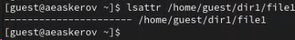{#fig:001 width=70%}

## Дискреционное разграничение прав в Linux

Установим на файл file1 права, разрешающие чтение и запись для владельца файла.

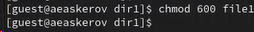{#fig:002 width=70%}

## Дискреционное разграничение прав в Linux

Попробуем установить на файл /home/guest/dir1/file1 расширенный атрибут a от имени пользователя guest.

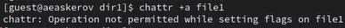{#fig:003 width=70%}

В ответ получен отказ от выполнения операции.

## Дискреционное разграничение прав в Linux

Повысим свои права с помощью команды su и попробуем установить расширенный атрибут a на файл /home/guest/dir1/file1 от имени суперпользователя.

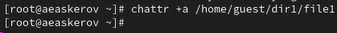{#fig:004 width=70%}

Получилось.

## Дискреционное разграничение прав в Linux

От пользователя guest проверим правильность установления атрибута.

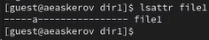{#fig:005 width=70%}

## Дискреционное разграничение прав в Linux

Выполним дозапись в файл file1 слова «test».

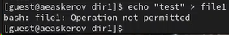{#fig:006 width=70%}

Операция не разрешена.

## Дискреционное разграничение прав в Linux

Попробуем стереть имеющуюся в file1 информацию.

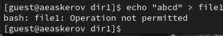{#fig:007 width=70%}

## Дискреционное разграничение прав в Linux

Попробуем переименовать файл.

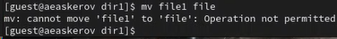{#fig:008 width=70%}

## Дискреционное разграничение прав в Linux

Попробуем установить на файл file1 права, например, запрещающие чтение и запись для владельца файла.

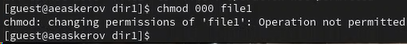{#fig:009 width=70%}

## Дискреционное разграничение прав в Linux

Снимем расширенный атрибут a с файла /home/guest/dirl/file1 от имени суперпользователя.

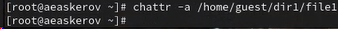{#fig:010 width=70%}

## Дискреционное разграничение прав в Linux

Повторим операции, которые ранее не удавалось выполнить.

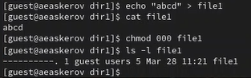{#fig:011 width=70%}

## Дискреционное разграничение прав в Linux

Повторим действия по шагам, заменив атрибут “a” атрибутом “i”.

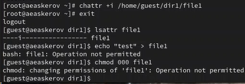{#fig:012 width=70%}

# Заключение

В ходе выполнения работы, мы смогли приобрести практические навыки работы в консоли с атрибутами файлов для групп пользователей.

## Список литературы{.unnumbered}

::: {#refs}
::: 
1. [Команда chattr](https://ru.wikipedia.org/wiki/Chattr)
