---
## Front matter
title: "Лабораторная работа №4"
subtitle: "Дискреционное разграничение прав в Linux. Расширенные атрибуты."
author: "Аскеров Александр Эдуардович"

## Generic otions
lang: ru-RU
toc-title: "Содержание"

## Bibliography
bibliography: bib/cite.bib
csl: pandoc/csl/gost-r-7-0-5-2008-numeric.csl

## Pdf output format
toc: true # Table of contents
toc-depth: 2
lof: true # List of figures
lot: false # List of tables
fontsize: 12pt
linestretch: 1.5
papersize: a4
documentclass: scrreprt
## I18n polyglossia
polyglossia-lang:
  name: russian
  options:
	- spelling=modern
	- babelshorthands=true
polyglossia-otherlangs:
  name: english
## I18n babel
babel-lang: russian
babel-otherlangs: english
## Fonts
mainfont: PT Serif
romanfont: PT Serif
sansfont: PT Sans
monofont: PT Mono
mainfontoptions: Ligatures=TeX
romanfontoptions: Ligatures=TeX
sansfontoptions: Ligatures=TeX,Scale=MatchLowercase
monofontoptions: Scale=MatchLowercase,Scale=0.9
## Biblatex
biblatex: true
biblio-style: "gost-numeric"
biblatexoptions:
  - parentracker=true
  - backend=biber
  - hyperref=auto
  - language=auto
  - autolang=other*
  - citestyle=gost-numeric
## Pandoc-crossref LaTeX customization
figureTitle: "Рис."
tableTitle: "Таблица"
listingTitle: "Листинг"
lofTitle: "Список иллюстраций"
lotTitle: "Список таблиц"
lolTitle: "Листинги"
## Misc options
indent: true
header-includes:
  - \usepackage{indentfirst}
  - \usepackage{float} # keep figures where there are in the text
  - \floatplacement{figure}{H} # keep figures where there are in the text
---

# Цель работы

Получение практических навыков работы в консоли с расширенными атрибутами файлов.

# Выполнение лабораторной работы

От имени пользователя guest определим расширенные атрибуты файла /home/guest/dir1/file1.

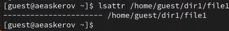{#fig:001 width=70%}

Установим на файл file1 права, разрешающие чтение и запись для владельца файла.

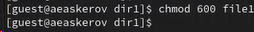{#fig:002 width=70%}

Попробуем установить на файл /home/guest/dir1/file1 расширенный атрибут a от имени пользователя guest.

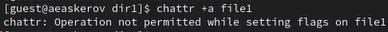{#fig:003 width=70%}

В ответ получен отказ от выполнения операции.

Повысим свои права с помощью команды su и попробуем установить расширенный атрибут a на файл /home/guest/dir1/file1 от имени суперпользователя.

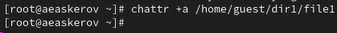{#fig:004 width=70%}

Получилось.

От пользователя guest проверим правильность установления атрибута.

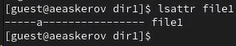{#fig:005 width=70%}

Выполним дозапись в файл file1 слова «test».

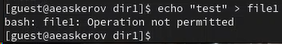{#fig:006 width=70%}

Операция не разрешена.

Попробуем стереть имеющуюся в file1 информацию.

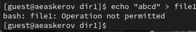{#fig:007 width=70%}

Попробуем переименовать файл.

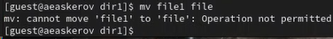{#fig:008 width=70%}

Попробуем установить на файл file1 права, например, запрещающие чтение и запись для владельца файла.

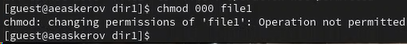{#fig:009 width=70%}

Снимем расширенный атрибут a с файла /home/guest/dirl/file1 от имени суперпользователя.

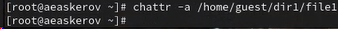{#fig:010 width=70%}

Повторим операции, которые ранее не удавалось выполнить.

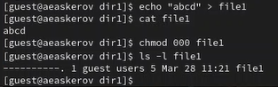{#fig:011 width=70%}

Повторим действия по шагам, заменив атрибут “a” атрибутом “i”.

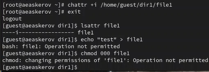{#fig:012 width=70%}

# Выводы

Получены практические навыки работы в консоли с расширенными атрибутами файлов.

# Список литературы{.unnumbered}

::: {#refs}
::: 
1. [Команда chattr](https://ru.wikipedia.org/wiki/Chattr)
