---
## Front matter
lang: ru-RU
title: Презентация №5
subtitle: Дискреционное разграничение прав в Linux. Исследование влияния дополнительных атрибутов
author:
  - Аскеров А.Э.
institute:
  - Российский университет дружбы народов, Москва, Россия
date: 13 апреля 2024

## i18n babel
babel-lang: russian
babel-otherlangs: english

## Formatting pdf
toc: false
toc-title: Содержание
slide_level: 2
aspectratio: 169
section-titles: true
theme: metropolis
header-includes:
 - \metroset{progressbar=frametitle,sectionpage=progressbar,numbering=fraction}
 - '\makeatletter'
 - '\beamer@ignorenonframefalse'
 - '\makeatother'

## Fonts
mainfont: PT Serif
romanfont: PT Serif
sansfont: PT Sans
monofont: PT Mono
mainfontoptions: Ligatures=TeX
romanfontoptions: Ligatures=TeX
sansfontoptions: Ligatures=TeX,Scale=MatchLowercase
monofontoptions: Scale=MatchLowercase,Scale=0.9
---
# Вступление

## Цель работы

Изучение механизмов изменения идентификаторов, применения SetUID- и Sticky-битов. Получение практических навыков работы в консоли с дополнительными атрибутами. Рассмотрение работы механизма смены идентификатора процессов пользователей, а также влияние бита Sticky на запись и удаление файлов.

# Выполнение лабораторной работы

## Создание программы

Отключим систему запретов до очередной перезагрузки системы.

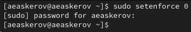{#fig:001 width=40%}

## Создание программы

Войдём в систему от имени пользователя guest.

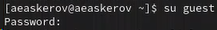{#fig:002 width=40%}

## Создание программы

Создадим программу simpleid.c.

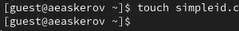{#fig:003 width=40%}

## Создание программы

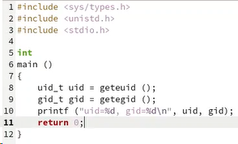{#fig:004 width=40%}

## Создание программы

Скомпилируем программу и убедимся, что файл программы создан.

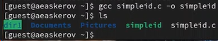{#fig:005 width=40%}

## Создание программы

Выполним программу simpleid.

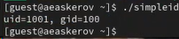{#fig:006 width=40%}

## Создание программы

Выполним системную программу id.

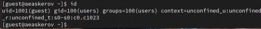{#fig:007 width=40%}

Видим, что выводы программы и команды id совпадают.

## Создание программы

Усложним программу, добавив вывод действительных идентификаторов.

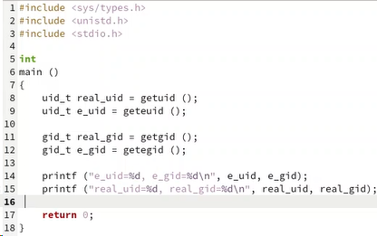{#fig:008 width=40%}

## Создание программы

Скомпилируем и запустим simpleid2.c.

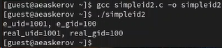{#fig:009 width=50%}

## Создание программы

От имени суперпользователя выполним следующие команды.

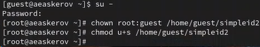{#fig:010 width=50%}

## Создание программы

Теперь пользователь root будет владельцем файла, а группа guest будет группой этого файла. Вторая команда устанавливает бит установки SUID для файла simpleid2, позволяющий запускать файл с привилегиями пользователя-владельца файла, а не пользователя, который запускает его.

Выполним проверку правильности установки новых атрибутов и смены владельца файла simpleid2.

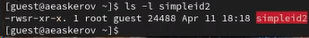{#fig:011 width=50%}

## Создание программы

Запустим simpleid2 и id.

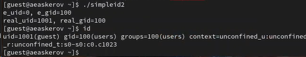{#fig:012 width=50%}

Результаты отличаются.

## Создание программы

Проделаем тоже самое относительно SetGID-бита.

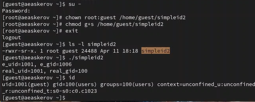{#fig:013 width=50%}

## Создание программы

Создадим программу readfile.c.

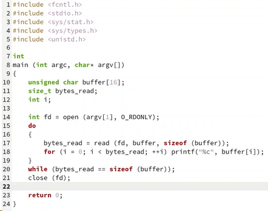{#fig:014 width=30%}

## Создание программы

Откомпилируем её.

{#fig:015 width=50%}

## Создание программы

Сменим владельца у файла readfile.c и изменим права так, чтобы только суперпользователь (root) мог прочитать его, a guest не мог.

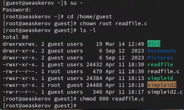{#fig:016 width=30%}

## Создание программы

Проверим, что пользователь guest не может прочитать файл readfile.c.

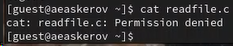{#fig:017 width=50%}

## Создание программы

Сменим у программы readfile владельца и установим SetU’D-бит.

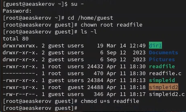{#fig:018 width=40%}

## Создание программы

Проверим, может ли программа readfile прочитать файл readfile.c.

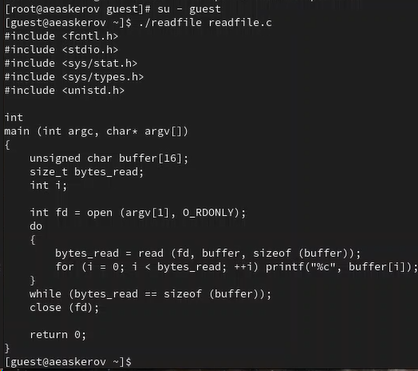{#fig:019 width=30%}

## Создание программы

Проверим, может ли программа readfile прочитать файл /etc/shadow.

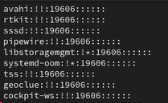{#fig:020 width=30%}

## Исследование Sticky-бита

Выясним, установлен ли атрибут Sticky на директории /tmp.

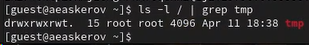{#fig:021 width=50%}

## Исследование Sticky-бита

От имени пользователя guest создадим файл file01.txt в директории /tmp со словом test.

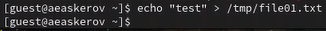{#fig:022 width=50%}

## Исследование Sticky-бита

Просмотрим атрибуты у только что созданного файла и разрешим чтение и запись для категории пользователей «все остальные».

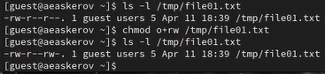{#fig:023 width=50%}

## Исследование Sticky-бита

От пользователя guest2 (не являющегося владельцем) попробуем прочитать файл /tmp/file01.txt.

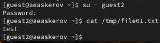{#fig:024 width=50%}

## Исследование Sticky-бита

От пользователя guest2 попробуем дозаписать в файл /tmp/file01.txt слово test2.

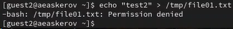{#fig:025 width=50%}

## Исследование Sticky-бита

Проверим содержимое файла.

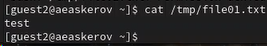{#fig:026 width=50%}

## Исследование Sticky-бита

От пользователя guest2 попробуем записать в файл /tmp/file01.txt слово test3, стерев при этом всю имеющуюся в файле информацию.

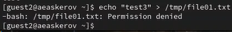{#fig:027 width=50%}

Доступ запрещён.

## Исследование Sticky-бита

Проверим содержимое файла.

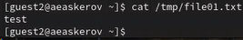{#fig:028 width=50%}

## Исследование Sticky-бита

От пользователя guest2 попробуем удалить файл /tmp/file01.txt.

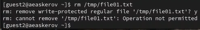{#fig:029 width=50%}

Удалить файл не удалось.

## Исследование Sticky-бита

Повысим свои права до суперпользователя и выполним после этого команду, снимающую атрибут t (Sticky-бит) с директории /tmp.

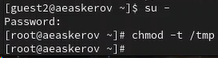{#fig:030 width=30%}

## Исследование Sticky-бита

Покинем режим суперпользователя.

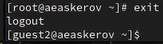{#fig:031 width=30%}

## Исследование Sticky-бита

От пользователя guest2 проверим, что атрибута t у директории /tmp нет.

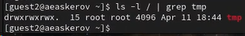{#fig:032 width=50%}

## Исследование Sticky-бита

Повторим предыдущие шаги.

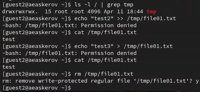{#fig:033 width=30%}

Ничего не изменилось, за исключением того, что файл получилось удалить от имени пользователя, не являющегося его владельцем.

## Исследование Sticky-бита

Повысим свои права до суперпользователя и вернём атрибут t на директорию /tmp.

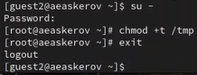{#fig:034 width=50%}

# Заключение

Изучены механизмы изменения идентификаторов, применения SetUID- и Sticky-битов. Получены практические навыки работы в консоли с дополнительными атрибутами. Рассмотрена работа механизма смены идентификатора процессов пользователей, а также влияние бита Sticky на запись и удаление файлов.

# Список литературы{.unnumbered}

::: {#refs}
:::
1. [How does the sticky bit work](https://unix.stackexchange.com/questions/79395/how-does-the-sticky-bit-work)

