---
## Front matter
title: "Лабораторная работа №5"
subtitle: "Дискреционное разграничение прав в Linux. Исследование влияния дополнительных атрибутов"
author: "Аскеров Александр Эдуардович"

## Generic otions
lang: ru-RU
toc-title: "Содержание"

## Bibliography
bibliography: bib/cite.bib
csl: pandoc/csl/gost-r-7-0-5-2008-numeric.csl

## Pdf output format
toc: true # Table of contents
toc-depth: 2
lof: true # List of figures
lot: false # List of tables
fontsize: 12pt
linestretch: 1.5
papersize: a4
documentclass: scrreprt
## I18n polyglossia
polyglossia-lang:
  name: russian
  options:
	- spelling=modern
	- babelshorthands=true
polyglossia-otherlangs:
  name: english
## I18n babel
babel-lang: russian
babel-otherlangs: english
## Fonts
mainfont: PT Serif
romanfont: PT Serif
sansfont: PT Sans
monofont: PT Mono
mainfontoptions: Ligatures=TeX
romanfontoptions: Ligatures=TeX
sansfontoptions: Ligatures=TeX,Scale=MatchLowercase
monofontoptions: Scale=MatchLowercase,Scale=0.9
## Biblatex
biblatex: true
biblio-style: "gost-numeric"
biblatexoptions:
  - parentracker=true
  - backend=biber
  - hyperref=auto
  - language=auto
  - autolang=other*
  - citestyle=gost-numeric
## Pandoc-crossref LaTeX customization
figureTitle: "Рис."
tableTitle: "Таблица"
listingTitle: "Листинг"
lofTitle: "Список иллюстраций"
lotTitle: "Список таблиц"
lolTitle: "Листинги"
## Misc options
indent: true
header-includes:
  - \usepackage{indentfirst}
  - \usepackage{float} # keep figures where there are in the text
  - \floatplacement{figure}{H} # keep figures where there are in the text
---

# Цель работы

Изучение механизмов изменения идентификаторов, применения SetUID- и Sticky-битов. Получение практических навыков работы в консоли с дополнительными атрибутами. Рассмотрение работы механизма смены идентификатора процессов пользователей, а также влияние бита Sticky на запись и удаление файлов.

# Выполнение лабораторной работы

## Создание программы

Отключим систему запретов до очередной перезагрузки системы.

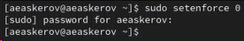{#fig:001 width=70%}

Войдём в систему от имени пользователя guest.

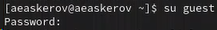{#fig:002 width=70%}

Создадим программу simpleid.c.

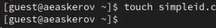{#fig:003 width=70%}

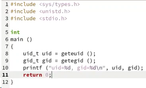{#fig:004 width=70%}

Скомпилируем программу и убедимся, что файл программы создан.

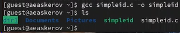{#fig:005 width=70%}

Выполним программу simpleid.

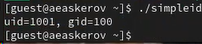{#fig:006 width=70%}

Выполним системную программу id.

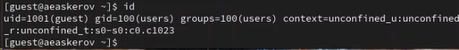{#fig:007 width=70%}

Видим, что выводы программы и команды id совпадают.

Усложним программу, добавив вывод действительных идентификаторов.

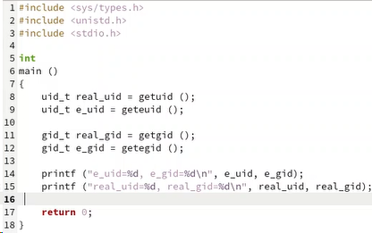{#fig:008 width=70%}

Скомпилируем и запустим simpleid2.c.

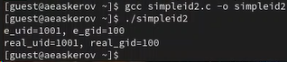{#fig:009 width=70%}

От имени суперпользователя выполним следующие команды.

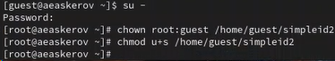{#fig:010 width=70%}

Теперь пользователь root будет владельцем файла, а группа guest будет группой этого файла. Вторая команда устанавливает бит установки SUID для файла simpleid2, позволяющий запускать файл с привилегиями пользователя-владельца файла, а не пользователя, который запускает его.

Выполним проверку правильности установки новых атрибутов и смены владельца файла simpleid2.

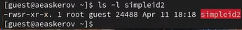{#fig:011 width=70%}

Запустим simpleid2 и id.

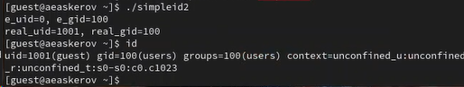{#fig:012 width=70%}

Результаты отличаются.

Проделаем тоже самое относительно SetGID-бита.

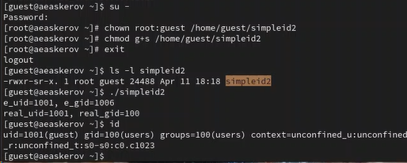{#fig:013 width=70%}

Создадим программу readfile.c.

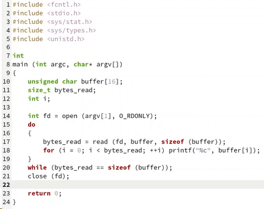{#fig:014 width=70%}

Откомпилируем её.

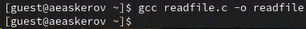{#fig:015 width=70%}

Сменим владельца у файла readfile.c и изменим права так, чтобы только суперпользователь (root) мог прочитать его, a guest не мог.

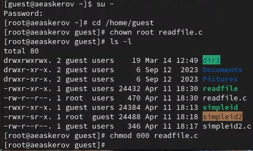{#fig:016 width=70%}

Проверим, что пользователь guest не может прочитать файл readfile.c.

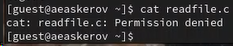{#fig:017 width=70%}

Сменим у программы readfile владельца и установим SetU’D-бит.

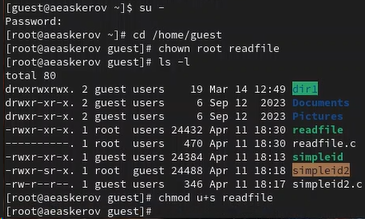{#fig:018 width=70%}

Проверим, может ли программа readfile прочитать файл readfile.c.

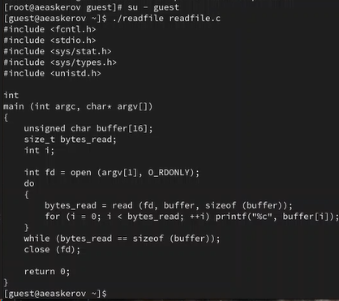{#fig:019 width=70%}

Проверим, может ли программа readfile прочитать файл /etc/shadow.

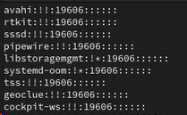{#fig:020 width=70%}

## Исследование Sticky-бита

Выясним, установлен ли атрибут Sticky на директории /tmp.

{#fig:021 width=70%}

От имени пользователя guest создадим файл file01.txt в директории /tmp со словом test.

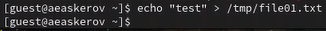{#fig:022 width=70%}

Просмотрим атрибуты у только что созданного файла и разрешим чтение и запись для категории пользователей «все остальные».

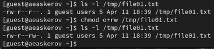{#fig:023 width=70%}

От пользователя guest2 (не являющегося владельцем) попробуем прочитать файл /tmp/file01.txt.

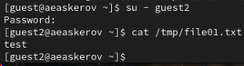{#fig:024 width=70%}

От пользователя guest2 попробуем дозаписать в файл /tmp/file01.txt слово test2.

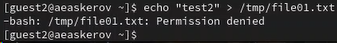{#fig:025 width=70%}

Проверим содержимое файла.

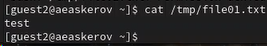{#fig:026 width=70%}

От пользователя guest2 попробуем записать в файл /tmp/file01.txt слово test3, стерев при этом всю имеющуюся в файле информацию.

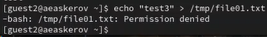{#fig:027 width=70%}

Доступ запрещён.

Проверим содержимое файла.

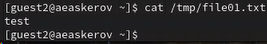{#fig:028 width=70%}

От пользователя guest2 попробуем удалить файл /tmp/file01.txt.

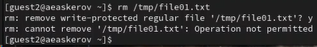{#fig:029 width=70%}

Удалить файл не удалось.

Повысим свои права до суперпользователя и выполним после этого команду, снимающую атрибут t (Sticky-бит) с директории /tmp.

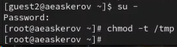{#fig:030 width=70%}

Покинем режим суперпользователя.

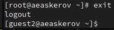{#fig:031 width=70%}

От пользователя guest2 проверим, что атрибута t у директории /tmp нет.

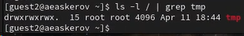{#fig:032 width=70%}

Повторим предыдущие шаги.

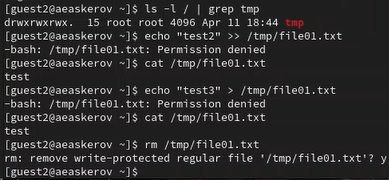{#fig:033 width=70%}

Ничего не изменилось, за исключением того, что файл получилось удалить от имени пользователя, не являющегося его владельцем.

Повысим свои права до суперпользователя и вернём атрибут t на директорию /tmp.

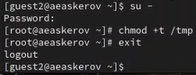{#fig:034 width=70%}

# Выводы

Изучены механизмы изменения идентификаторов, применения SetUID- и Sticky-битов. Получены практические навыки работы в консоли с дополнительными атрибутами. Рассмотрена работа механизма смены идентификатора процессов пользователей, а также влияние бита Sticky на запись и удаление файлов.

# Список литературы{.unnumbered}

::: {#refs}
:::
1. [How does the sticky bit work](https://unix.stackexchange.com/questions/79395/how-does-the-sticky-bit-work)
