---
## Front matter
lang: ru-RU
title: Презентация №6
subtitle: Мандатное разграничение прав в Linux
author:
  - Аскеров А.Э.
institute:
  - Российский университет дружбы народов, Москва, Россия
date: 26 апреля 2024

## i18n babel
babel-lang: russian
babel-otherlangs: english

## Formatting pdf
toc: false
toc-title: Содержание
slide_level: 2
aspectratio: 169
section-titles: true
theme: metropolis
header-includes:
 - \metroset{progressbar=frametitle,sectionpage=progressbar,numbering=fraction}
 - '\makeatletter'
 - '\beamer@ignorenonframefalse'
 - '\makeatother'

## Fonts
mainfont: PT Serif
romanfont: PT Serif
sansfont: PT Sans
monofont: PT Mono
mainfontoptions: Ligatures=TeX
romanfontoptions: Ligatures=TeX
sansfontoptions: Ligatures=TeX,Scale=MatchLowercase
monofontoptions: Scale=MatchLowercase,Scale=0.9
---

# Вступление

## Цель работы

Развить навыки администрирования ОС Linux. Получить первое практическое знакомство с технологией SELinux.

Проверить работу SELinx на практике совместно с веб-сервером Apache.

# Выполнение лабораторной работы

## Мандатное разграничение прав в Linux

Войдём в систему с полученными учётными данными и убедимся, что SELinux работает в режиме enforcing политики targeted с помощью команд getenforce и sestatus.

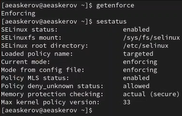{#fig:001 width=35%}

## Мандатное разграничение прав в Linux

Обратимся с помощью браузера к веб-серверу, запущенному на компьютере, и убедимся, что последний работает.

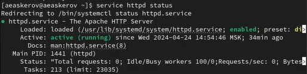{#fig:002 width=70%}

## Мандатное разграничение прав в Linux

Найдём веб-сервер Apache в списке процессов, определим его контекст безопасности.

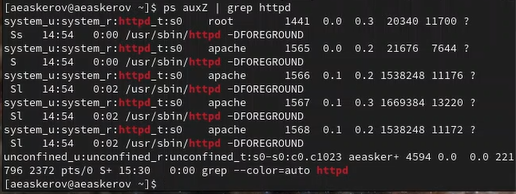{#fig:003 width=70%}

## Мандатное разграничение прав в Linux

Посмотрим текущее состояние переключателей SELinux для Apache.

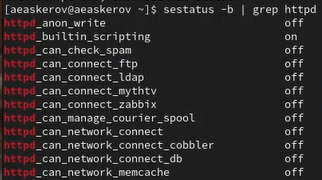{#fig:004 width=70%}

## Мандатное разграничение прав в Linux

Посмотрим статистику по политике с помощью команды seinfo, также определим множество пользователей, ролей, типов.

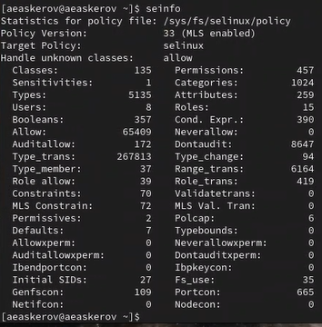{#fig:005 width=35%}

## Мандатное разграничение прав в Linux

Определим тип файлов и поддиректорий, находящихся в директории /var/www.

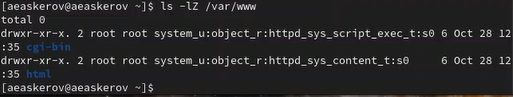{#fig:006 width=70%}

## Мандатное разграничение прав в Linux

Определим тип файлов, находящихся в директории /var/www/html.

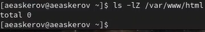{#fig:007 width=50%}

## Мандатное разграничение прав в Linux

Определим круг пользователей, которым разрешено создание файлов в директории /var/www/html.

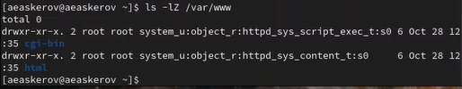{#fig:008 width=70%}

## Мандатное разграничение прав в Linux

Создадим от имени суперпользователя html-файл /var/www/html/test.html следующего содержания.

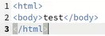{#fig:009 width=20%}

## Мандатное разграничение прав в Linux

Проверим контекст созданного файла. Запишем контекст, присваиваемый по умолчанию вновь созданным файлам в директории /var/www/html.

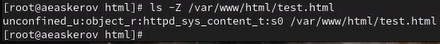{#fig:010 width=70%}

## Мандатное разграничение прав в Linux

Обратимся к файлу через веб-сервер, введя в браузере адрес http://127.0.0.1/test.html.

Изучим справку man httpd_selinux.

## Мандатное разграничение прав в Linux

Изменим контекст файла /var/www/html/test.html с httpd_sys_content_t на любой другой, к которому процесс httpd не должен иметь доступа, например, на samba_share_t.

{#fig:011 width=70%}

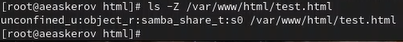{#fig:012 width=70%}

## Мандатное разграничение прав в Linux

Попробуем ещё раз получить доступ к файлу через веб-сервер, введя в браузере адрес http://127.0.0.1/test.html. Получено сообщение об ошибке.

Проанализируем ситуацию. Просмотрим log-файлы веб-сервера Apache. Также просмотрим системный лог-файл.

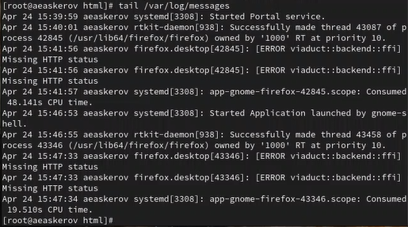{#fig:013 width=35%}

## Мандатное разграничение прав в Linux

Посмотрим файл /var/log/audit/audit.log.

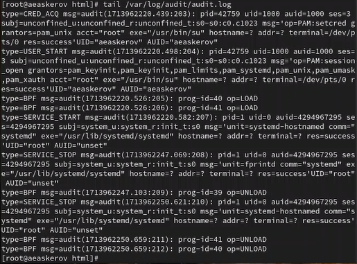{#fig:014 width=35%}

## Мандатное разграничение прав в Linux

Попробуем запустить веб-сервер Apache на прослушивание ТСР-порта 81 (а не 80, как рекомендует IANA и прописано в /etc/services). Для этого в файле /etc/httpd/httpd.conf найдём строчку Listen 80 и заменим её на Listen 81.

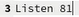{#fig:015 width=20%}

## Мандатное разграничение прав в Linux

Выполним перезапуск веб-сервера Apache. Произошёл сбой из-за изменения порта.

Проанализируем лог-файлы.

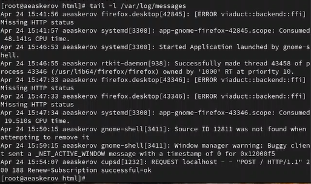{#fig:016 width=35%}

## Мандатное разграничение прав в Linux

Просмотрим файлы /var/log/http/error_log, /var/log/http/access_log и /var/log/audit/audit.log и выясним, в каких файлах появились записи.

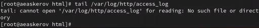{#fig:017 width=70%}

## Мандатное разграничение прав в Linux

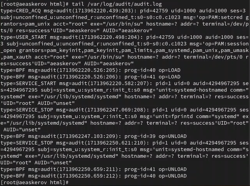{#fig:018 width=40%}

## Мандатное разграничение прав в Linux

Выполним следующую команду.

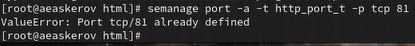{#fig:019 width=70%}

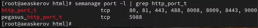{#fig:020 width=70%}

Порт 81 появился в списке.

## Мандатное разграничение прав в Linux

Попробуем запустить веб-сервер Apache ещё раз. Теперь он запустился.

Вернём контекст httpd_sys_cоntent__t к файлу /var/www/html/test.html.

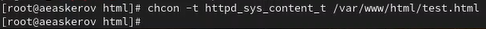{#fig:021 width=70%}

## Мандатное разграничение прав в Linux

После этого попробуем получить доступ к файлу через веб-сервер, введя в браузере адрес http://127.0.0.1:81/test.html.

Мы видим содержимое файла – слово «test».

Исправим обратно конфигурационный файл apache, вернув Listen 80.

{#fig:022 width=20%}

## Мандатное разграничение прав в Linux

Удалим привязку http_port_t к 81-му порту.

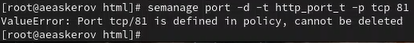{#fig:023 width=70%}

## Мандатное разграничение прав в Linux

Удалим файл /var/www/html/test.html.

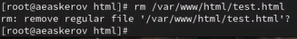{#fig:024 width=70%}

# Заключение

Развиты навыки администрирования ОС Linux. Получено первое практическое знакомство с технологией SELinux.

Проверена работа SELinx на практике совместно с веб-сервером Apache.

# Список литературы{.unnumbered}

::: {#refs}
:::
1. [Веб-сервер Apache](https://httpd.apache.org/)
