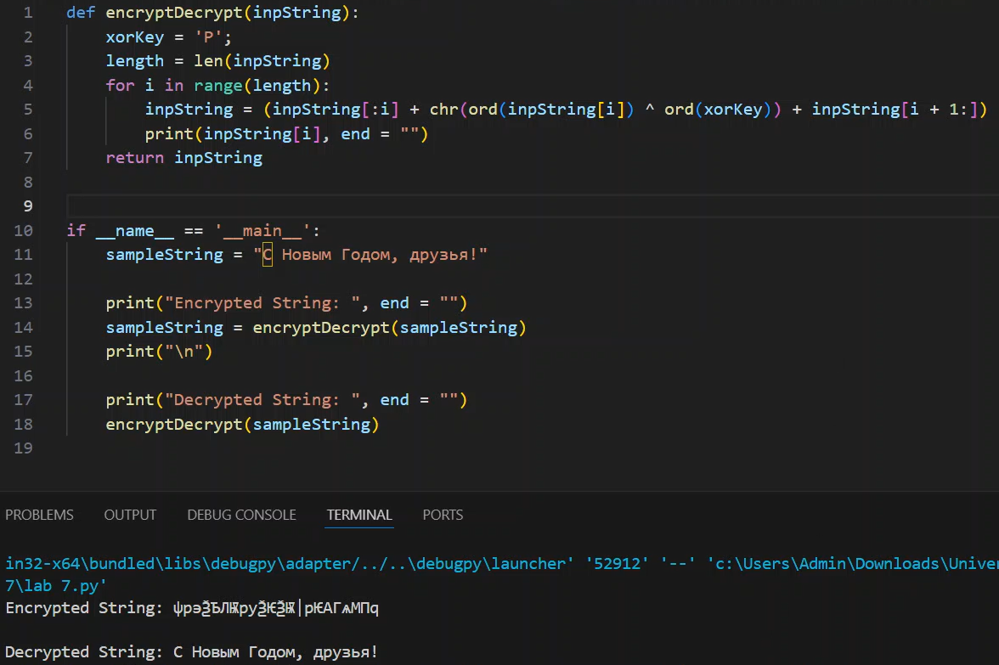

---
## Front matter
lang: ru-RU
title: Презентация №7
subtitle: Элементы криптографии. Однократное гаммирование
author:
  - Аскеров А.Э.
institute:
  - Российский университет дружбы народов, Москва, Россия
date: 9 мая 2024

## i18n babel
babel-lang: russian
babel-otherlangs: english

## Formatting pdf
toc: false
toc-title: Содержание
slide_level: 2
aspectratio: 169
section-titles: true
theme: metropolis
header-includes:
 - \metroset{progressbar=frametitle,sectionpage=progressbar,numbering=fraction}
 - '\makeatletter'
 - '\beamer@ignorenonframefalse'
 - '\makeatother'

## Fonts
mainfont: PT Serif
romanfont: PT Serif
sansfont: PT Sans
monofont: PT Mono
mainfontoptions: Ligatures=TeX
romanfontoptions: Ligatures=TeX
sansfontoptions: Ligatures=TeX,Scale=MatchLowercase
monofontoptions: Scale=MatchLowercase,Scale=0.9
---

# Вступление

## Цель работы

Освоить на практике применение режима однократного гаммирования.

# Выполнение лабораторной работы

Приложение, позволяющее шифровать и дешифровать данные в режиме однократного гаммирования:

{#fig:001 width=50%}

# Заключение

Применение режима однократного гаммирования освоено на практике.

# Список литературы{.unnumbered}

::: {#refs}
:::
1. [XOR cypher](https://en.wikipedia.org/wiki/XOR_cipher)
