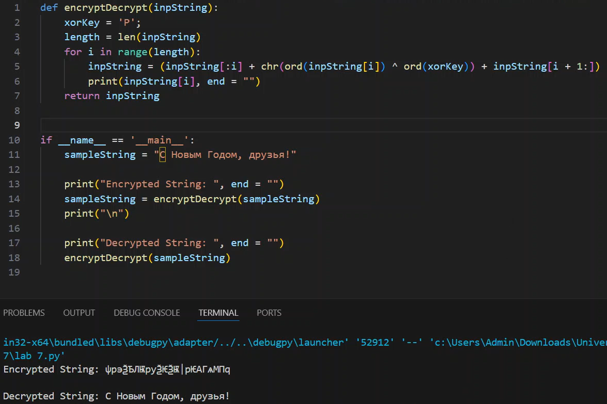

---
## Front matter
title: "Лабораторная работа №7"
subtitle: "Элементы криптографии. Однократное гаммирование"
author: "Аскеров Александр Эдуардович"

## Generic otions
lang: ru-RU
toc-title: "Содержание"

## Bibliography
bibliography: bib/cite.bib
csl: pandoc/csl/gost-r-7-0-5-2008-numeric.csl

## Pdf output format
toc: true # Table of contents
toc-depth: 2
lof: true # List of figures
lot: false # List of tables
fontsize: 12pt
linestretch: 1.5
papersize: a4
documentclass: scrreprt
## I18n polyglossia
polyglossia-lang:
  name: russian
  options:
	- spelling=modern
	- babelshorthands=true
polyglossia-otherlangs:
  name: english
## I18n babel
babel-lang: russian
babel-otherlangs: english
## Fonts
mainfont: PT Serif
romanfont: PT Serif
sansfont: PT Sans
monofont: PT Mono
mainfontoptions: Ligatures=TeX
romanfontoptions: Ligatures=TeX
sansfontoptions: Ligatures=TeX,Scale=MatchLowercase
monofontoptions: Scale=MatchLowercase,Scale=0.9
## Biblatex
biblatex: true
biblio-style: "gost-numeric"
biblatexoptions:
  - parentracker=true
  - backend=biber
  - hyperref=auto
  - language=auto
  - autolang=other*
  - citestyle=gost-numeric
## Pandoc-crossref LaTeX customization
figureTitle: "Рис."
tableTitle: "Таблица"
listingTitle: "Листинг"
lofTitle: "Список иллюстраций"
lotTitle: "Список таблиц"
lolTitle: "Листинги"
## Misc options
indent: true
header-includes:
  - \usepackage{indentfirst}
  - \usepackage{float} # keep figures where there are in the text
  - \floatplacement{figure}{H} # keep figures where there are in the text
---

# Цель работы

Освоить на практике применение режима однократного гаммирования.

# Теоретическое введение

## Шифр гаммирования

Гаммирование – это наложение (снятие) на открытые (зашифрованные) данные криптографической гаммы, т.е. последовательности элементов данных, вырабатываемых с помощью некоторого криптографического алгоритма, для получения зашифрованных (открытых) данных.

Принцип шифрования гаммированием заключается в генерации гаммы шифра с помощью датчика псевдослучайных чисел и наложении полученной гаммы шифра на открытые данные обратимым образом (например, используя операцию сложения по модулю 2). Процесс дешифрования сводится к повторной генерации гаммы шифра при известном ключе и наложении такой же гаммы на зашифрованные данные. Полученный зашифрованный текст является достаточно трудным для раскрытия в том случае, если гамма шифра не содержит повторяющихся битовых последовательностей и изменяется случайным образом для каждого шифруемого слова. Если период гаммы превышает длину всего зашифрованного текста и неизвестна никакая часть исходного текста, то шифр можно раскрыть только прямым перебором (подбором ключа). В этом случае криптостойкость определяется размером ключа.

Метод гаммирования становится бессильным, если известен фрагмент исходного текста и соответствующая ему шифрограмма. В этом случае простым вычитанием по модулю 2 получается отрезок псевдослучайной последовательности и по нему восстанавливается вся эта последовательность.

Метод гаммирования с обратной связью заключается в том, что для получения сегмента гаммы используется контрольная сумма определенного участка шифруемых данных. Например, если рассматривать гамму шифра как объединение непересекающихся множеств H(j), то процесс шифрования можно пердставить следующими шагами:

* Генерация сегмента гаммы H(1) и наложение его на соответствующий участок шифруемых данных.

* Подсчет контрольной суммы участка, соответствующего сегменту гаммы H(1).

* Генерация с учетом контрольной суммы уже зашифрованного участка данных следующего сегмента гамм H(2).

* Подсчет контрольной суммы участка данных, соответствующего сегменту данных H(2) и т.д.

# Выполнение лабораторной работы

Приложение, позволяющее шифровать и дешифровать данные в режиме однократного гаммирования:

{#fig:001 width=70%}

# Выводы

Применение режима однократного гаммирования освоено на практике.

# Контрольные вопросы

1. Однократное гаммирование – это метод шифрования, при котором каждый символ открытого текста комбинируется с соответствующим символом ключа только один раз.

2. Недостатки однократного гаммирования:
* Уязвимость к атакам частотного анализа из-за повторяющихся шифротекстов.
* Необходимость генерации случайного ключа такой же длины, что и открытый текст.
* Один и тот же ключ не может использоваться повторно для шифрования других сообщений.

3. Преимущества однократного гаммирования:
* При правильной реализации обеспечивает абсолютную стойкость.
* Шифротекст не подвержен атакам, основанным на статистическом анализе.

4. Длина открытого текста должна совпадать с длиной ключа в однократном гаммировании, чтобы каждый символ открытого текста мог быть комбинирован с соответствующим символом ключа.

5. В режиме однократного гаммирования используется операция XOR (исключающее ИЛИ), которая комбинирует каждый бит открытого текста с соответствующим битом ключа. Особенностью XOR является то, что результат равен 1 только в случае, если входные биты различны.

6. Для получения шифротекста по открытому тексту и ключу необходимо применить операцию XOR между каждым символом открытого текста и соответствующим символом ключа.

7. Получение ключа по открытому тексту и шифротексту в случае однократного гаммирования невозможно без знания исходного ключа, так как операция XOR необратима.

8. Необходимые и достаточные условия абсолютной стойкости шифра включают в себя:
* Ключ должен быть случайным, длинным и использоваться только один раз.
* Ключ должен быть такой же длины, что и открытый текст.
* Ключ должен быть известен только отправителю и получателю сообщения.

# Список литературы{.unnumbered}

::: {#refs}
:::
1. [XOR cypher](https://en.wikipedia.org/wiki/XOR_cipher)
