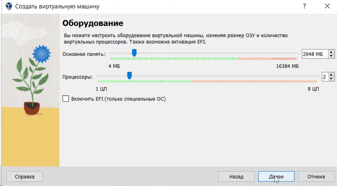
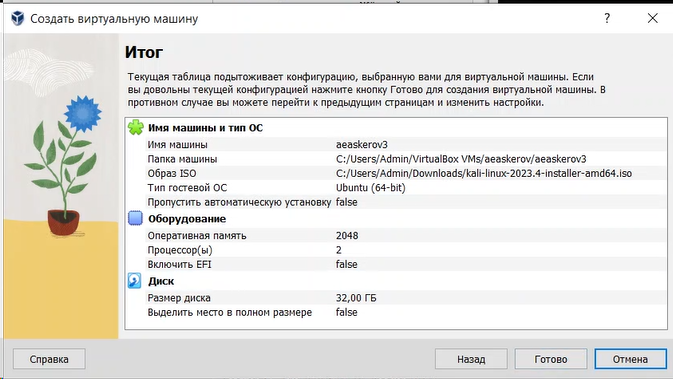
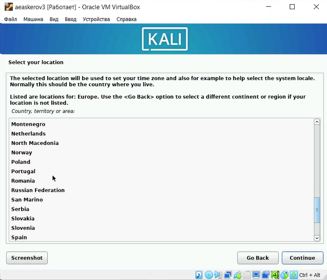
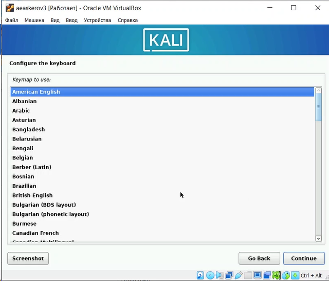
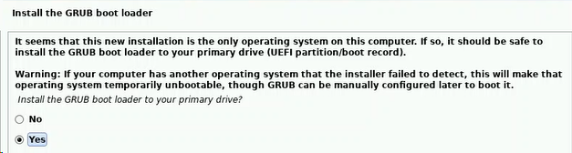
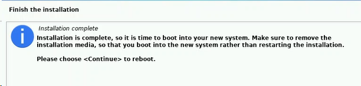

---
## Front matter
lang: ru-RU
title: Индивидуальный проект
subtitle: Этап 1. Установка Kali Linux"
author:
  - Аскеров А.Э.
institute:
  - Российский университет дружбы народов, Москва, Россия
date: 01 марта 2024

## i18n babel
babel-lang: russian
babel-otherlangs: english

## Formatting pdf
toc: false
toc-title: Содержание
slide_level: 2
aspectratio: 169
section-titles: true
theme: metropolis
header-includes:
 - \metroset{progressbar=frametitle,sectionpage=progressbar,numbering=fraction}
 - '\makeatletter'
 - '\beamer@ignorenonframefalse'
 - '\makeatother'
 
## Fonts
mainfont: PT Serif
romanfont: PT Serif
sansfont: PT Sans
monofont: PT Mono
mainfontoptions: Ligatures=TeX
romanfontoptions: Ligatures=TeX
sansfontoptions: Ligatures=TeX,Scale=MatchLowercase
monofontoptions: Scale=MatchLowercase,Scale=0.9
---

# Вступление

## Цель работы

Установить и настроить Kali Linux.

# Выполнение лабораторной работы

## Установка Kali Linux

Создадим новую виртуальную машину, нажав кнопку Создать.

{#fig:001 width=40%}

## Установка Kali Linux

Укажем имя ВМ, выберем образ для неё.

{#fig:002 width=70%}

## Установка Kali Linux

Выделим основную память и число процессоров.

{#fig:003 width=70%}

## Установка Kali Linux

Определим размер виртуального жёсткого диска.

{#fig:004 width=70%}

## Установка Kali Linux

Увидим итоговые настройки ВМ.

{#fig:005 width=70%}

## Установка Kali Linux

Запустим ВМ и укажем язык системы.

{#fig:006 width=50%}

## Установка Kali Linux

Укажем страну.

{#fig:007 width=50%}

## Установка Kali Linux

Укажем раскладку клавиатуры.

{#fig:008 width=50%}

## Установка Kali Linux

Подождём пока пройдёт загрузка.

Укажем имя хоста.

{#fig:009 width=40%}

## Установка Kali Linux

Укажем пароль.

{#fig:010 width=40%}

## Установка Kali Linux

Разделим диск.

{#fig:011 width=50%}

## Установка Kali Linux

Завершим разделение.

{#fig:012 width=50%}

## Установка Kali Linux

Выберем запись изменений на диск.

{#fig:013 width=70%}

## Установка Kali Linux

Выберем ПО для установки.

{#fig:014 width=70%}

## Установка Kali Linux

Установим загрузчик GRUB.

{#fig:015 width=70%}

## Установка Kali Linux

Выберем устройство для загрузчика.

{#fig:016 width=70%}

## Установка Kali Linux

Завершим установку и перезагрузим ВМ.

{#fig:017 width=70%}

## Установка Kali Linux

Авторизуемся.

{#fig:018 width=70%}

# Заключение

 Установлена и настроена Kali Linux.
