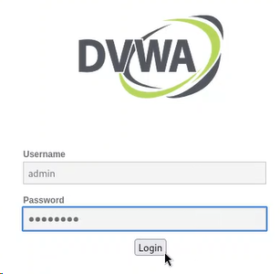
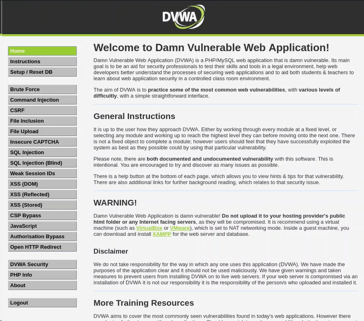

---
## Front matter
lang: ru-RU
title: Индивидуальный проект
subtitle: Этап 2. Установка DVWA
author:
  - Аскеров А.Э.
institute:
  - Российский университет дружбы народов, Москва, Россия
date: 16 марта 2024

## i18n babel
babel-lang: russian
babel-otherlangs: english

## Formatting pdf
toc: false
toc-title: Содержание
slide_level: 2
aspectratio: 169
section-titles: true
theme: metropolis
header-includes:
 - \metroset{progressbar=frametitle,sectionpage=progressbar,numbering=fraction}
 - '\makeatletter'
 - '\beamer@ignorenonframefalse'
 - '\makeatother'

## Fonts
mainfont: PT Serif
romanfont: PT Serif
sansfont: PT Sans
monofont: PT Mono
mainfontoptions: Ligatures=TeX
romanfontoptions: Ligatures=TeX
sansfontoptions: Ligatures=TeX,Scale=MatchLowercase
monofontoptions: Scale=MatchLowercase,Scale=0.9
---

# Вступление

## Цель работы

Установить DVWA в гостевую систему к Kali Linux.

# Выполнение лабораторной работы

## Установка DVWA

Перейдём в каталог html.

{#fig:001 width=70%}

## Установка DVWA

Клонируем репозиторий git.

{#fig:002 width=70%}

## Установка DVWA

Изменим права доступа к папке установки.

{#fig:003 width=70%}

## Установка DVWA

Перейдём к файлу конфигурации в каталоге установки.

{#fig:004 width=70%}

## Установка DVWA

Скопируем файл конфигурации и переименуем его.

{#fig:005 width=70%}

## Установка DVWA

Откроем файл настроек и изменим пароль на что-то более простое для ввода.

{#fig:006 width=70%}

## Установка DVWA

Установим mariadb.

{#fig:007 width=70%}

{#fig:008 width=70%}

## Установка DVWA

Запустим базу данных.

{#fig:009 width=70%}

## Установка DVWA

Войдём в базу данных.

{#fig:010 width=70%}

## Установка DVWA

Создадим пользователя базы данных. Нужно использовать те же имя пользователя и пароль, которые использовались в файле конфигурации.

{#fig:011 width=70%}

## Установка DVWA

Предоставим пользователю все привилегии.

{#fig:012 width=70%}

## Установка DVWA

Перейдём в каталог apache2 для настройки сервера Apache.

{#fig:013 width=70%}

## Установка DVWA

Откроем для редактирования файл php.ini, чтобы включить следующие параметры: allow_url_fopen и allow_url_include.

{#fig:014 width=70%}

{#fig:015 width=70%}

## Установка DVWA

Запустим сервер Apache.

{#fig:016 width=70%}

## Установка DVWA

Откроем DVWA в браузере, введя в адресной строке следующее.

{#fig:017 width=20%}

## Установка DVWA

Прокрутим вниз и нажмём Create/Reset Database (Создать/сбросить базу данных). Это создаст базу данных, и через несколько секунд мы будем перенаправлены на страницу входа в DVWA.

{#fig:018 width=70%}

## Установка DVWA

Введём следующие учётные данные: admin и password.

{#fig:019 width=40%}

## Установка DVWA

Теперь мы авторизовались и находимся на начальной странице DVWA.

{#fig:020 width=30%}

# Заключение

DVWA установлено в гостевую систему к Kali Linux.
