---
## Front matter
title: "Индивидуальный проект. Этап 2."
subtitle: "Установка DVWA"
author: "Аскеров Александр Эдуардович"

## Generic otions
lang: ru-RU
toc-title: "Содержание"

## Bibliography
bibliography: bib/cite.bib
csl: pandoc/csl/gost-r-7-0-5-2008-numeric.csl

## Pdf output format
toc: true # Table of contents
toc-depth: 2
lof: true # List of figures
lot: true # List of tables
fontsize: 12pt
linestretch: 1.5
papersize: a4
documentclass: scrreprt
## I18n polyglossia
polyglossia-lang:
  name: russian
  options:
	- spelling=modern
	- babelshorthands=true
polyglossia-otherlangs:
  name: english
## I18n babel
babel-lang: russian
babel-otherlangs: english
## Fonts
mainfont: PT Serif
romanfont: PT Serif
sansfont: PT Sans
monofont: PT Mono
mainfontoptions: Ligatures=TeX
romanfontoptions: Ligatures=TeX
sansfontoptions: Ligatures=TeX,Scale=MatchLowercase
monofontoptions: Scale=MatchLowercase,Scale=0.9
## Biblatex
biblatex: true
biblio-style: "gost-numeric"
biblatexoptions:
  - parentracker=true
  - backend=biber
  - hyperref=auto
  - language=auto
  - autolang=other*
  - citestyle=gost-numeric
## Pandoc-crossref LaTeX customization
figureTitle: "Рис."
tableTitle: "Таблица"
listingTitle: "Листинг"
lofTitle: "Список иллюстраций"
lotTitle: "Список таблиц"
lolTitle: "Листинги"
## Misc options
indent: true
header-includes:
  - \usepackage{indentfirst}
  - \usepackage{float} # keep figures where there are in the text
  - \floatplacement{figure}{H} # keep figures where there are in the text
---

# Цель работы

Установить DVWA в гостевую систему к Kali Linux.

# Выполнение лабораторной работы

Перейдём в каталог html.

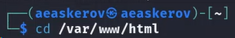{#fig:001 width=70%}

Клонируем репозиторий git.

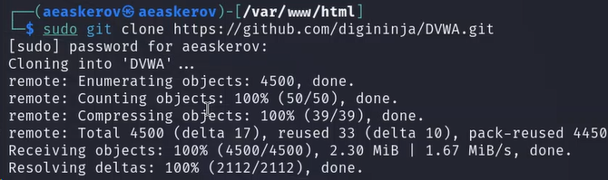{#fig:002 width=70%}

Изменим права доступа к папке установки.

{#fig:003 width=70%}

Перейдём к файлу конфигурации в каталоге установки.

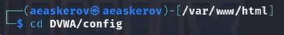{#fig:004 width=70%}

Скопируем файл конфигурации и переименуем его.

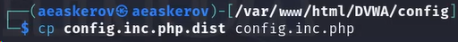{#fig:005 width=70%}

Откроем файл настроек и изменим пароль на что-то более простое для ввода.

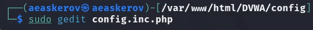{#fig:006 width=70%}

Установим mariadb.

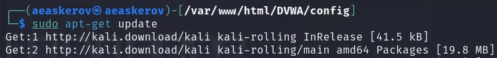{#fig:007 width=70%}

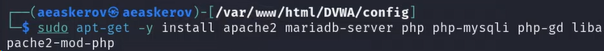{#fig:008 width=70%}

Запустим базу данных.

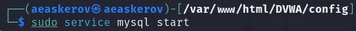{#fig:009 width=70%}

Войдём в базу данных.

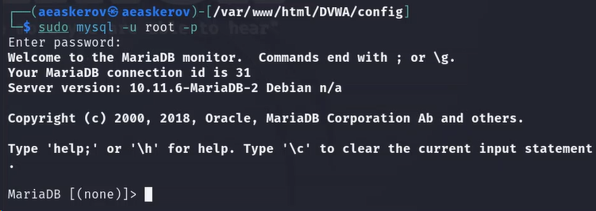{#fig:010 width=70%}

Создадим пользователя базы данных. Нужно использовать те же имя пользователя и пароль, которые использовались в файле конфигурации.

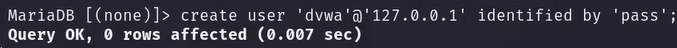{#fig:011 width=70%}

Предоставим пользователю все привилегии.

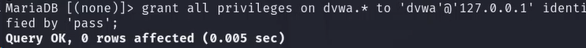{#fig:012 width=70%}

Перейдём в каталог apache2 для настройки сервера Apache.

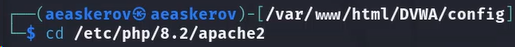{#fig:013 width=70%}

Откроем для редактирования файл php.ini, чтобы включить следующие параметры: allow_url_fopen и allow_url_include.

{#fig:014 width=70%}

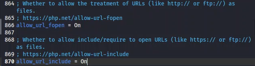{#fig:015 width=70%}

Запустим сервер Apache.

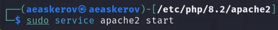{#fig:016 width=70%}

Откроем DVWA в браузере, введя в адресной строке следующее.

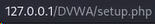{#fig:017 width=70%}

Прокрутим вниз и нажмём Create/Reset Database (Создать/сбросить базу данных). Это создаст базу данных, и через несколько секунд мы будем перенаправлены на страницу входа в DVWA.

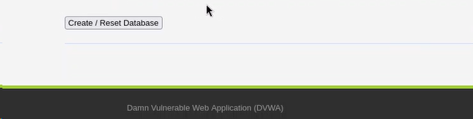{#fig:018 width=70%}

Введём следующие учётные данные: admin и password.

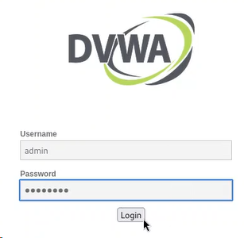{#fig:019 width=70%}

Теперь мы авторизовались и находимся на начальной странице DVWA.

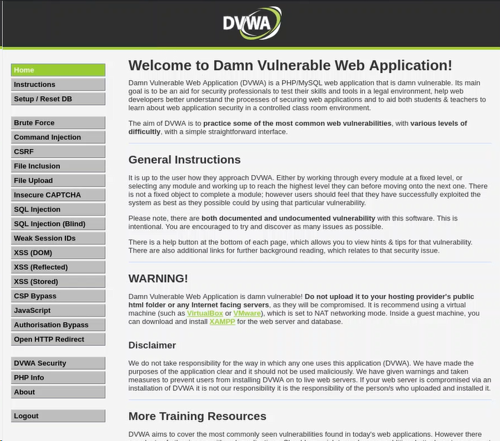{#fig:020 width=70%}

# Выводы

DVWA установлено в гостевую систему к Kali Linux.

# Список литературы{.unnumbered}

1. [Установка и использование DVWA на Kali Linux](https://spy-soft.net/dvwa-kali-linux/)
