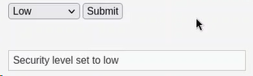
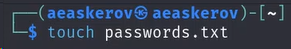
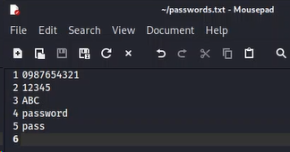
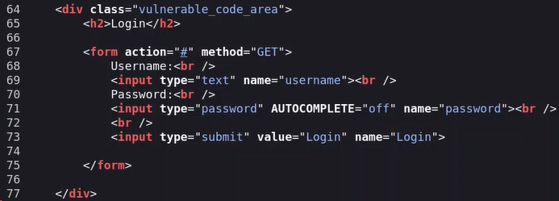
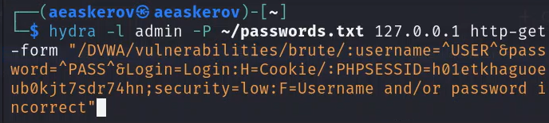
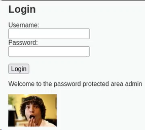

---
## Front matter
lang: ru-RU
title: Индивидуальный проект
subtitle: Этап 3. Использование Hydra
author:
  - Аскеров А.Э.
institute:
  - Российский университет дружбы народов, Москва, Россия
date: 30 марта 2024

## i18n babel
babel-lang: russian
babel-otherlangs: english

## Formatting pdf
toc: false
toc-title: Содержание
slide_level: 2
aspectratio: 169
section-titles: true
theme: metropolis
header-includes:
 - \metroset{progressbar=frametitle,sectionpage=progressbar,numbering=fraction}
 - '\makeatletter'
 - '\beamer@ignorenonframefalse'
 - '\makeatother'

## Fonts
mainfont: PT Serif
romanfont: PT Serif
sansfont: PT Sans
monofont: PT Mono
mainfontoptions: Ligatures=TeX
romanfontoptions: Ligatures=TeX
sansfontoptions: Ligatures=TeX,Scale=MatchLowercase
monofontoptions: Scale=MatchLowercase,Scale=0.9
---

# Вступление

## Цель работы

Научиться использовать инструмент Hydra для нахождения паролей для авторизации.

# Выполнение лабораторной работы

## Использование Hydra

Запустим DVWA.Перейдём в раздел DVWA Security и установим уровень защиты на “Low”.

{#fig:001 width=70%}

## Использование Hydra

Создадим файл passwords.txt, в котором укажем пароли для подстановки.

{#fig:002 width=70%}

## Использование Hydra

Запишем варианты паролей в нём.

{#fig:003 width=70%}

## Использование Hydra

Откроем код веб-страницы и посмотрим метод отправки формы.

{#fig:004 width=40%}

Видим, что используется метод “GET”.

## Использование Hydra

Теперь откроем Инспектор, перейдём в раздел Storage и скопируем значение PHPSESSID.

{#fig:005 width=30%}

## Использование Hydra

Перейдём в консоль и воспользуемся Hydra – вставим полученное значение PHPSESSID в один из аргументов команды.

{#fig:006 width=70%}

## Использование Hydra

По выполнении команды мы видим подходящие значения для авторизации. Введём их и успешно авторизуемся.

{#fig:007 width=40%}

# Заключение

Изучено использование инструмента Hydra для нахождения паролей для авторизации.
