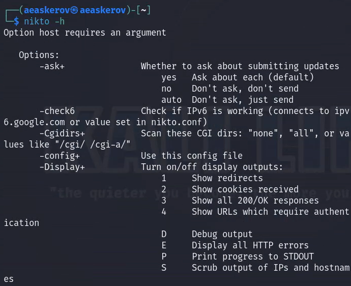
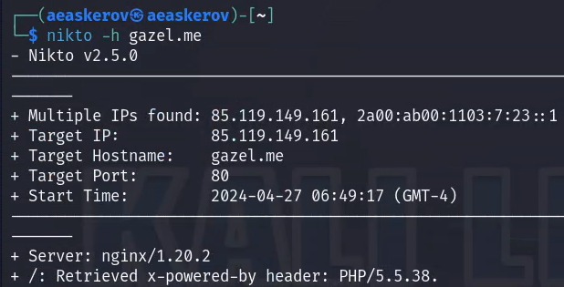
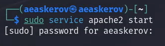
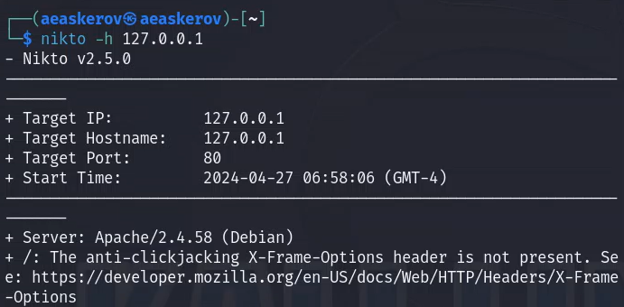
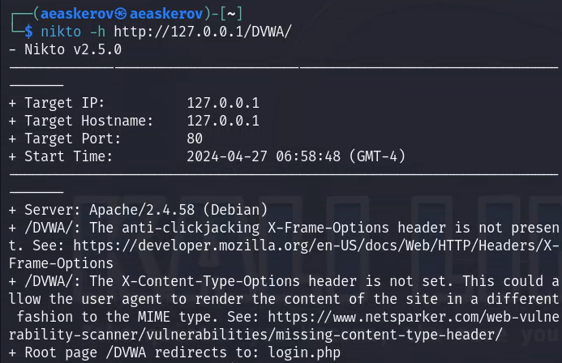
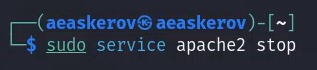

---
## Front matter
lang: ru-RU
title: Индивидуальный проект
subtitle: Этап 4. Использование nikto
author:
  - Аскеров А.Э.
institute:
  - Российский университет дружбы народов, Москва, Россия
date: 27 апреля 2024

## i18n babel
babel-lang: russian
babel-otherlangs: english

## Formatting pdf
toc: false
toc-title: Содержание
slide_level: 2
aspectratio: 169
section-titles: true
theme: metropolis
header-includes:
 - \metroset{progressbar=frametitle,sectionpage=progressbar,numbering=fraction}
 - '\makeatletter'
 - '\beamer@ignorenonframefalse'
 - '\makeatother'

## Fonts
mainfont: PT Serif
romanfont: PT Serif
sansfont: PT Sans
monofont: PT Mono
mainfontoptions: Ligatures=TeX
romanfontoptions: Ligatures=TeX
sansfontoptions: Ligatures=TeX,Scale=MatchLowercase
monofontoptions: Scale=MatchLowercase,Scale=0.9
---

# Вступление

## Цель работы

Познакомиться с nikto.

# Выполнение лабораторной работы

## Использование nikto

Посмотрим справку по nikto.

{#fig:001 width=45%}

## Использование nikto

Просканируем сайт gazel.me.

{#fig:002 width=70%}

## Использование nikto

Запустим apache-сервер.

{#fig:003 width=30%}

## Использование nikto

Просканируем локальную сеть.

{#fig:004 width=70%}

## Использование nikto

Просканируем DVWA.

{#fig:005 width=50%}

## Использование nikto

Выключим apache-сервер.

{#fig:006 width=30%}

# Заключение

Изучен сервис nikto.

# Список литературы{.unnumbered}

::: {#refs}
:::
1. [An introduction to web-server scanning with nikto](https://www.freecodecamp.org/news/an-introduction-to-web-server-scanning-with-nikto/)
