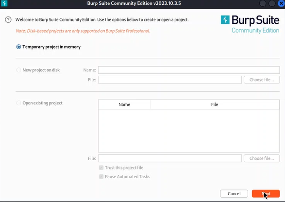
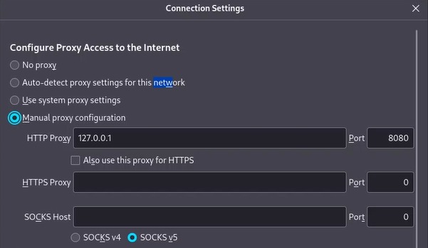
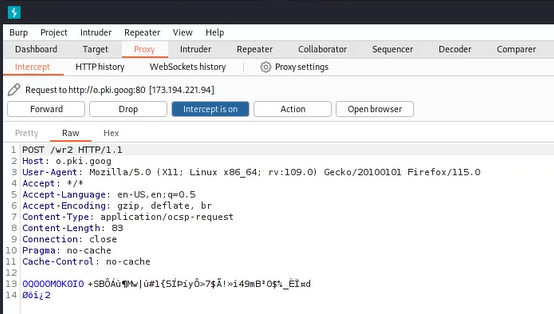
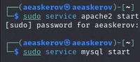
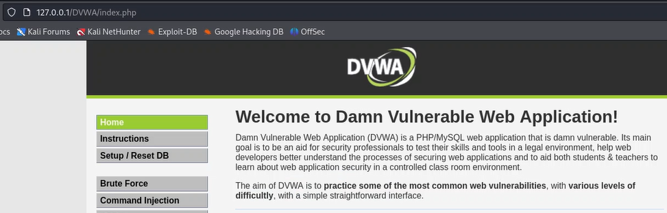

---
## Front matter
lang: ru-RU
title: Индивидуальный проект
subtitle: Этап 5. Использование burp suite
author:
  - Аскеров А.Э.
institute:
  - Российский университет дружбы народов, Москва, Россия
date: 10 мая 2024

## i18n babel
babel-lang: russian
babel-otherlangs: english

## Formatting pdf
toc: false
toc-title: Содержание
slide_level: 2
aspectratio: 169
section-titles: true
theme: metropolis
header-includes:
 - \metroset{progressbar=frametitle,sectionpage=progressbar,numbering=fraction}
 - '\makeatletter'
 - '\beamer@ignorenonframefalse'
 - '\makeatother'

## Fonts
mainfont: PT Serif
romanfont: PT Serif
sansfont: PT Sans
monofont: PT Mono
mainfontoptions: Ligatures=TeX
romanfontoptions: Ligatures=TeX
sansfontoptions: Ligatures=TeX,Scale=MatchLowercase
monofontoptions: Scale=MatchLowercase,Scale=0.9
---

# Вступление

## Цель работы

Получить представление о работе с burp suite.

# Выполнение лабораторной работы

## Использование burp suite

Включим burp suite.

{#fig:001 width=50%}

## Использование burp suite

Ознакомимся со стартовым экраном проекта.

{#fig:002 width=90%}

## Использование burp suite

Включим перехват (“Intercept is on”).

{#fig:003 width=70%}

## Использование burp suite

Откроем браузер и укажем следующие настройки соединения.

{#fig:004 width=70%}

## Использование burp suite

После этого мы переключаемся на burp suite и видим информацию по подключению.

{#fig:005 width=50%}

## Использование burp suite

Запустим apache2 и mysql.

{#fig:006 width=30%}

## Использование burp suite

Зайдём в DVWA.

{#fig:007 width=70%}

# Заключение

Получено представление о работе с burp suite.

# Список литературы{.unnumbered}

::: {#refs}
:::
1. [portswigger](https://portswigger.net/)

